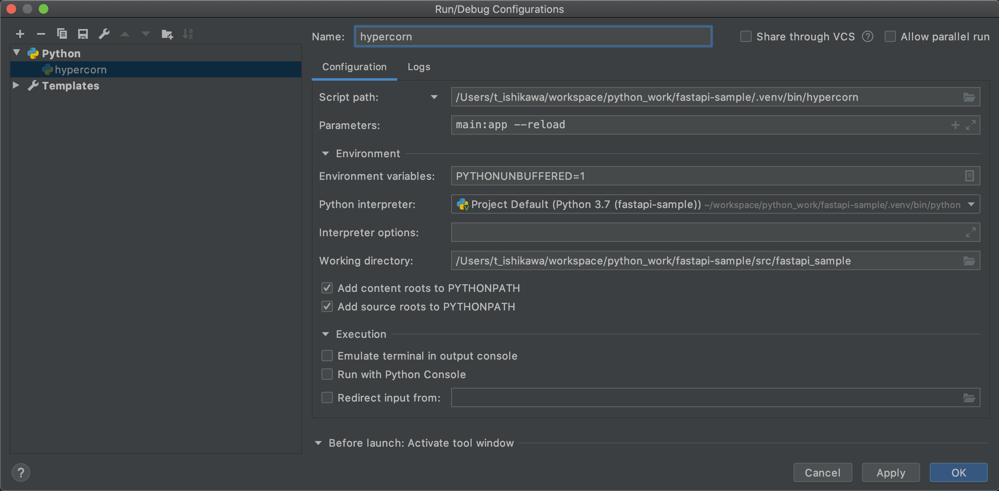

# FastAPI template

[fastapi](https://fastapi.tiangolo.com/)

## environment

to make a virtual environment inside this project 

```
poetry config virtualenvs.in-project true

```

## start this project

```
poetry install
```

## how to use with pycharm

